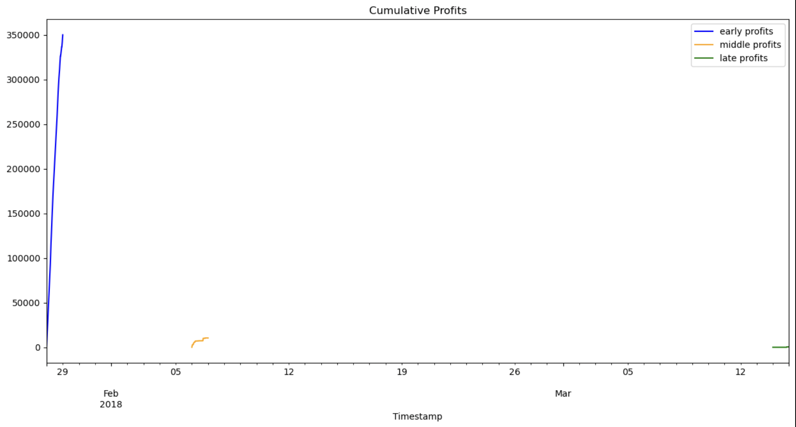
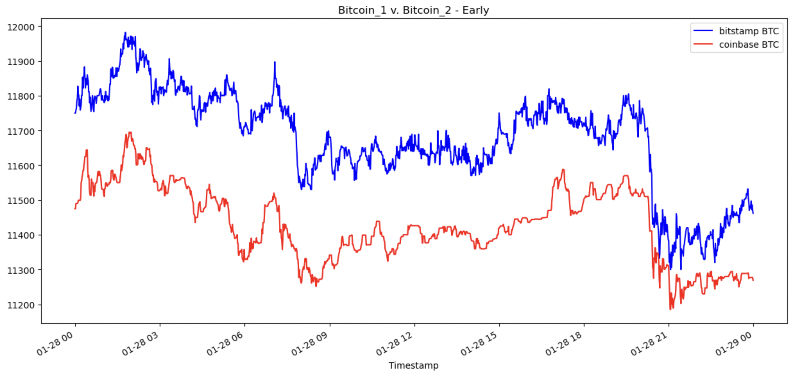
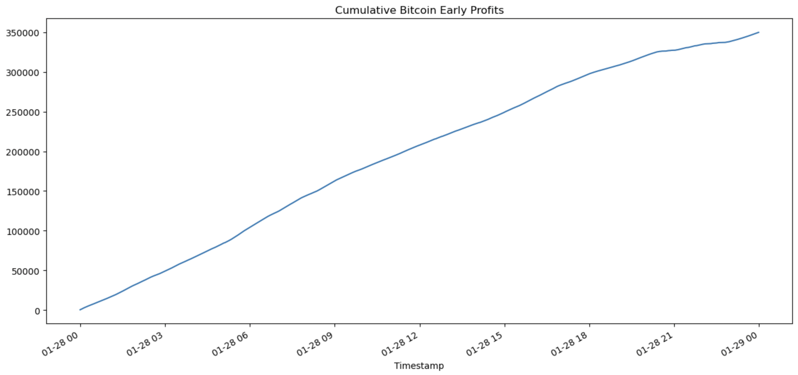
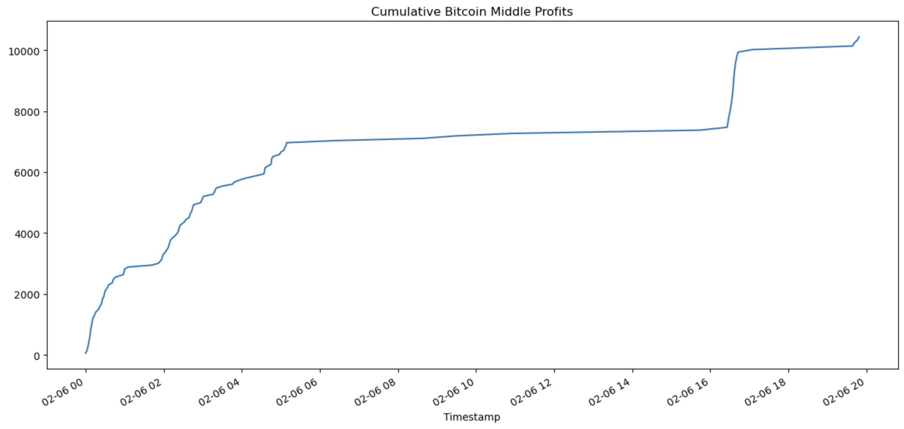
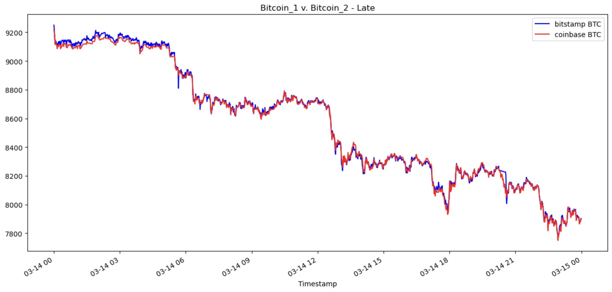
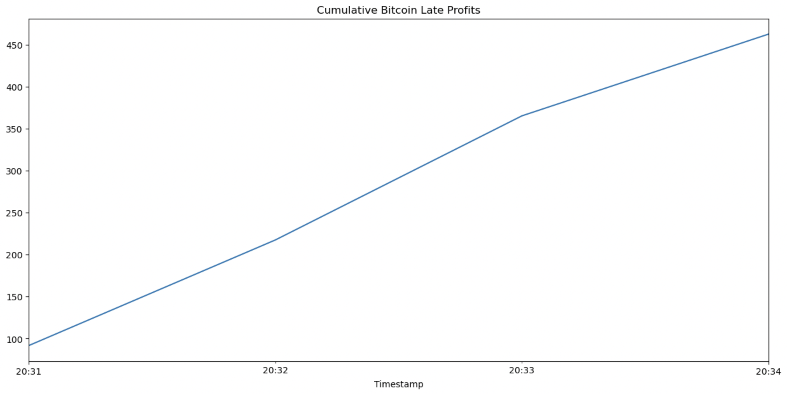
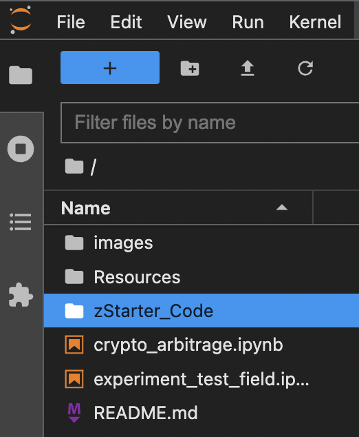

# **Columbia University Engineering, New York FinTech BootCamp** 
# **August 2022 Cohort**
## *Module 3, Challenge - retrospective identification and analysis of Bitcoin arbitrage opportunities within a three month time period*

This is a financial analysis application. This analysis utilizes a web-based interactive development environment (IDE) interface to run a data processing application which retrospectively examines the arbitrage trade opportunities for Bitcoin using bitstamp and coinbase exchanges over a three month period in 2018.  

It's purpose is to demonstrate as Bitcoin trades on markets across the globe, one may capitalize on simultaneous price dislocations in those markets through the capabilities of Pandas.  With this objective in mind, historical trade data for Bitcoin on two exchanges: Bitstamp and Coinbase is explored. Three phases of financial analysis are used to determine if any arbitrage opportunities existed for Bitcoin.

This application script is run through Jupyter Lab web-based interactive development environment to perform the analysis.  The analysis employs a three phase financial analysis approach (data collection, preparation, and analysis) to identify potentially profitable arbitrage opportunities that may have existed between bitstamp and coinbase exchanges over a three month period in 2018.  For the purpose of this analysis, a profitable arbitrage trade is defined as one in which the return was equal to or greater than 1%.  This would thus take into account 1/2% cost to buy in conjunction with 1/2% cost to sell.  

The Bitcoin trading data for the time period analyzed was collected and processed from `bitstamp.csv` and `coinbase.csv` data files.  From this data, three one day periods were identified for potential arbitrage trade opportunity comparisons, 'early', 'middle', and 'late'.  These three days utilized for this analysis do not represent the only opportunities available.  Rather, they represent the greatest opportunities for the time period of the data from which each was chosen.

Beyond the scope of the assignment, the author sought to conduct additional processing of the data obtained through processing and provide further visualization with combined data plots of the three one-day time periods examined.  The image included below is a rough example that is more thoroughly explained within the body of the analysis.



In brief, this image demonstrates the gross magnitude and duration of arbitrage opportunities on three specific days during the 3 months (i.e. blue, orange, & green).  It is generally apparent that both the magnitude and duration of intraday arbitrage trading opportunities significantly decreased from the early, middle, and late periods, showing an effective equalization in pricing between the two exchanges examined and thus loss of further arbitrage opportunities.


By utilizing MinMaxScaler, the specific line plots of each intraday arbitrage period have been overlayed.  This eliminates any overt sense of 'magnitude' comparisons between each day while enabling examination of the shape or morphology of the different periods, early, middle, and late.  The early demonstrates a steady and consistent trading morphology.  The middle shows burst periods followed by pauses which lengthen and/or coincide with subsequent bursts being diminished.  Finally, the late is grossly flat throughout the day with an apparent single burst opportunity which is generally consistent and demonstrated within the more granular analysis.

---
## **Methods**

The code script will

    Individually Read in the seperate CSV files called 'bitstamp.csv' and 'coinbase.csv' from the Resources folder using the Path module.
        Generate two dataframes using `read_csv`
        Set the index to the column 'Timestamp'
        Set the parse_dates and infer_datetime_format parameters
    
    
    Individually prepare the dateframes by cleaning missing and / or erroneous data using 
        drop all `NaN` or missing values
        `str.replace` function to remove the dollar signs ($) from the values in the Close column
        Convert the data type of the Close column to a `float`
        examine the data within the dataframes for duplicated values, and drop as necessary

    High level analysis is then commenced summary statistics and visualizations through  and  via
        generating subset dataframes with `.loc` function, specifically examining the Close column
        generate summary statistics using `.describe()` allowing for derivation of gross comparisons 
        
    Analysis is continued going from the macro timeframes to select areas for deeper analysis from specific daily timeframes
        this if further focused on three days within the three months, specifically from early, middle, and late in the three months
        plot function is then used to develop visualizations for the three trading day periods of interest between the two exchanges


  
### Three month timeframe comparative arbitrage plots bitstamp vs coinbase Bitcoin pricing



### early price spread

### potential early cummulative arbitrage profits for one day examined. 
    average profit per trade - 253.93 
    number of profitable trades - 1378
    cumulative potential profit from all trades - 349918.29


### middle price spread

### potential middle cummulative arbitrage profits for one day examined.
    average profit per trade - 94.87
    number of profitable trades -  110
    cumulative potential profit from all trades - 10435.98



### late price spread

### potential late cummulative arbitrage profits for one day examined.
    average profit per trade - 115.60
    number of profitable trades - 4
    cumulative potential profit from all trades - 462.39

  

---
## **Technologies**
---
### **Dependencies**

This project leverages Jupyter Lab v3.4.4 and python v3.7 with the following packages:

* [Path](https://docs.python.org/3/library/pathlib.html?highlight=path#module-pathlib) - From 'pathlib', Object-oriented filesystem paths, used to identify a file

* [pandas](https://pandas.pydata.org/docs/) - Software library written for the Python programming language for data manipulation and analysis.

* [read_csv](https://pandas.pydata.org/docs/reference/api/pandas.read_csv.html?highlight=read_csv#) - From 'pandas', read a comma-separated values (csv) file into DataFrame

For additional and / or supplemental processing and visulaization this project also makes use of the following packages:

* [DataFrame](https://pandas.pydata.org/docs/reference/api/pandas.DataFrame.html?highlight=dataframe#pandas.DataFrame) - From 'pandas', to construct a dataframe, i.e. a two-dimensional, size-mutable, potentially heterogeneous tabular data

* [MinMaxScaler](https://pandas.pydata.org/docs/) - from sklearn, preprocessing package provides several common utility functions and transformer classes to change raw feature vectors into a representation that is more suitable for the downstream estimators, transforms features by scaling each feature to a given range.


### **Hardware used for development**

MacBook Pro (16-inch, 2021)

    Chip Appple M1 Max
    macOS Monterey version 12.5.1

### **Development Software**

Homebrew 3.5.10

    Homebrew/homebrew-core (git revision 0b6b6d9004e; last commit 2022-08-30)
    Homebrew/homebrew-cask (git revision 63ae652861; last commit 2022-08-30)

anaconda Command line client 1.10.0

    conda 4.13.0
    Python 3.7.13

pip 22.1.2 from /opt/anaconda3/envs/dev/lib/python3.7/site-packages/pip (python 3.7)


git version 2.37.2

---
## *Installation of application (i.e. github clone)*

 In the terminal, navigate to directory where you want to install this application from the repository and enter the following command

```python
git clone git@github.com:Billie-LS/FinTech_Homeworks.git
```

---
## **Usage**

From terminal, the installed application is run through jupyter lab web-based interactive development environment (IDE) interface by typing at prompt:

```python
  > jupyter lab
```

Within jupyter lab web-based interactive development environment (IDE) interface, you will then navigate to file 'homework 3' and double click: crypto_arbitrage.ipynb


---
## **Project requirements**
### see starter code



---
## **Version control**

Version control can be reviewed at:

```python
https://github.com/Billie-LS/FinTech_Homeworks/tree/homework3
```

[repository](https://github.com/Billie-LS/FinTech_Homeworks/tree/homework3)


---
## **Contributors**

### **Author**

Loki 'billie' Skylizard
    [LinkedIn](https://www.linkedin.com/in/l-s-6a0316244)
    [@GitHub](https://github.com/Billie-LS)


### **BootCamp lead instructor**

Vinicio De Sola
    [LinkedIn](https://www.linkedin.com/in/vinicio-desola-jr86/)
    [@GitHub](https://github.com/penpen86)


### **BootCamp teaching assistants**

Corey Recai
    [LinkedIn](https://www.linkedin.com/in/corey-recai/)

Santiago Pedemonte
    [LinkedIn](https://www.linkedin.com/in/s-pedemonte/)
    [@GitHub](https://github.com/Santiago-Pedemonte)


### **BootCamp classmates**

Stratis Gavnoudias
    [LinkedIn](https://www.linkedin.com/in/stratis-gavnoudias-465b527/)
    [@GitHub](https://github.com/sgavnoudias)


### **Slack application, student support services via 'askBCS'**

Roberto Salazar
    [LinkedIn](https://www.linkedin.com/in/roberto-salazar-reyna/)
    [@GitHub](https://github.com/rsalaza4)

Mark S.

---
## **License**

MIT License

Copyright (c) [2022] [Loki 'billie' Skylizard]

Permission is hereby granted, free of charge, to any person obtaining a copy
of this software and associated documentation files (the "Software"), to deal
in the Software without restriction, including without limitation the rights
to use, copy, modify, merge, publish, distribute, sublicense, and/or sell
copies of the Software, and to permit persons to whom the Software is
furnished to do so, subject to the following conditions:

The above copyright notice and this permission notice shall be included in all
copies or substantial portions of the Software.

THE SOFTWARE IS PROVIDED "AS IS", WITHOUT WARRANTY OF ANY KIND, EXPRESS OR
IMPLIED, INCLUDING BUT NOT LIMITED TO THE WARRANTIES OF MERCHANTABILITY,
FITNESS FOR A PARTICULAR PURPOSE AND NONINFRINGEMENT. IN NO EVENT SHALL THE
AUTHORS OR COPYRIGHT HOLDERS BE LIABLE FOR ANY CLAIM, DAMAGES OR OTHER
LIABILITY, WHETHER IN AN ACTION OF CONTRACT, TORT OR OTHERWISE, ARISING FROM,
OUT OF OR IN CONNECTION WITH THE SOFTWARE OR THE USE OR OTHER DEALINGS IN THE
SOFTWARE.

